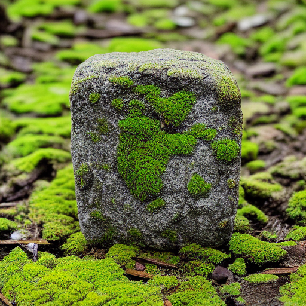

# Stable-Diffusion-Burn

Stable-Diffusion-Burn is a Rust-based project which ports the V1 stable diffusion model into the deep learning framework, Burn. This repository is licensed under the MIT Licence.

## Support The Project

Stable-Diffusion-Burn is a passion project that is open and free to all. I want to empower everyone with reliable AI that can be run by ourselves on our own hardware to ensure that great AI is not limited to the hands of the few. If you support this vision consider supporting me so that I can continue on this journey and produce more projects such as Stable Diffusion XL in Rust.

You can show your support by buying a shirt at https://www.bonfire.com/machine-learning/. The shirt image was, of course, generated by my Rust powered Stable Diffusion! I'd love to release more projects and any support will help make that happen!

Any contribution would be greatly appreciated. Thanks!

## How To Use

### Step 1: Download the Model and Set Environment Variables

Start by downloading the SDv1-4.bin model provided on HuggingFace.

```bash
wget https://huggingface.co/Gadersd/Stable-Diffusion-Burn/resolve/main/V1/SDv1-4.bin
```

### Step 2: Run the Sample Binary

Invoke the sample binary provided in the rust code. By default, wgpu is used which requires a gpu with at least 10 GB of VRAM (will be lower in the future), but torch can be used with the `torch-backend` feature and can run on a 6 GB gpu.

```bash
# wgpu (NEEDS >= 10 GB VRAM)
# Arguments: <model_type(burn or dump)> <model> <unconditional_guidance_scale> <n_diffusion_steps> <prompt> <output_image>
cargo run --release --bin sample burn SDv1-4 7.5 20 "An ancient mossy stone." img

# torch (at least 6 GB VRAM, possibly less)
export TORCH_CUDA_VERSION=cu113
# Arguments: <model_type(burn or dump)> <model> <unconditional_guidance_scale> <n_diffusion_steps> <prompt> <output_image>
cargo run --release --features torch-backend --bin sample burn SDv1-4 7.5 20 "An ancient mossy stone." img
```

This command will generate an image according to the provided prompt, which will be saved as 'img0.png'.



### Optional: Extract and Convert a Fine-Tuned Model

If users are interested in using a fine-tuned version of stable diffusion, the Python scripts provided in this project can be used to transform a weight dump into a Burn model file. Note: the tinygrad dependency should be installed from source rather than with pip.

```bash
# Step into the Python directory
cd python

# Download the model, this is just the base v1.4 model as an example
wget https://huggingface.co/CompVis/stable-diffusion-v-1-4-original/resolve/main/sd-v1-4.ckpt

# Extract the weights
CPU=1 python3 dump.py sd-v1-4.ckpt

# Move the extracted weight folder out
mv params ..

# Step out of the Python directory
cd ..

# Convert the weights into a usable form
cargo run --release --bin convert params SDv1-4
```

The binaries 'convert' and 'sample' are contained in Rust. Convert works on CPU whereas sample needs CUDA.

Remember, `convert` should be used if you're planning on using the fine-tuned version of the stable diffusion. 

## License

This project is licensed under MIT license.

We wish you a productive time using this project. Enjoy!
